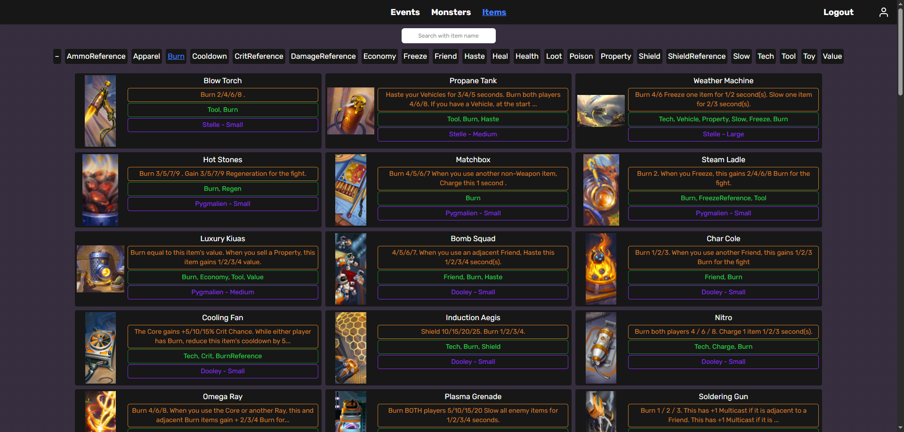

Hosted on fly.io: https://bazaar-wiki-heist.fly.dev/

Website for the autobattler game "Bazaar". My intention was to scrape item/event/monster details from the bazaar wiki and display them in a more user friendly manner.

Some screenshots of the website, in case I take it down.

